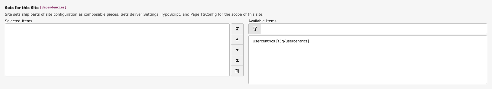

.. include:: /Includes.rst.txt

.. _configuration:

=============
Configuration
=============

Include The Site Set
====================

After the extension has been installed, a new site set called "Usercentrics" is made
available. After inclusion of the site set, basic configuration of the extension is
propagated to the website and takes effect on all pages within the tree.

The set can also be included in the site's :file:`config.yaml`:

.. code-block:: yaml

   dependencies:
     - t3g/usercentrics

Configure The Usercentrics Settings ID
======================================

The site set ships a setting for the Usercentrics Settings ID that is used to load the
Usercentrics library associated with the account that holds further configuration.

In your :file:`settings.yaml`, set the Usercentrics Settings ID as follows:

.. code-block:: yaml

   plugin:
     tx_usercentrics:
       settingsId: XXXXXXXX

The settings can also be edited in the TYPO3 backend under
:guilabel:`Site Management > Sites > [your site] > Settings`.

.. important::
   As soon as the site set is included, the Settings ID must not be empty. An empty
   Settings ID raises an exception, because the Usercentrics library could not be
   loaded in a meaningful way.

Configure The Usercentrics Default Language
===========================================

The site set ships a setting for the default language to be used.
The language must be enabled in the Usercentrics account settings and provided as
ISO 639-1 code. The special keyword :yaml:`current` is replaced by the current site
language automatically and is the default.

In your :file:`settings.yaml`, set the default language as follows:

.. code-block:: yaml

   plugin:
     tx_usercentrics:
       language: en
